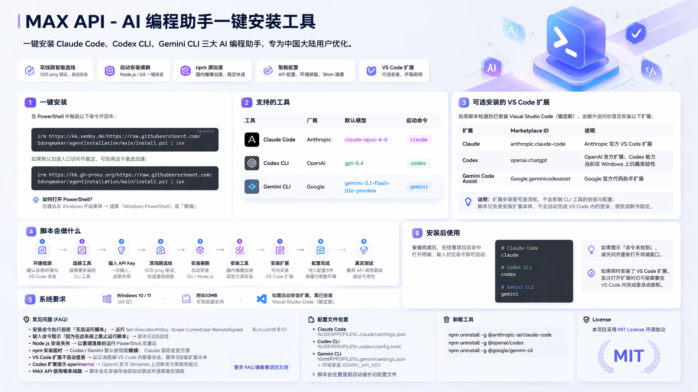

# MAX API - AI 编程助手一键安装工具

MAX API 一键安装 **Claude Code**、**Codex CLI**、**Gemini CLI** 三大 AI 编程助手，专为中国大陆用户优化。

自动处理：Node.js/Git 依赖安装、npm 源选择与加速、安装前 MAX API 双线路选线、API 配置、真实调用测试。Windows 脚本额外处理 PowerShell 兼容修复；如检测到 **VS Code**，还可按需安装对应扩展。Linux 脚本额外提供用户级运行时、安装锁、日志、修复与卸载入口。

## 项目预览



## 一键安装

### Windows PowerShell

在 PowerShell 中粘贴以下命令并回车：

```powershell
irm https://kk.eemby.de/https://raw.githubusercontent.com/Sdongmaker/agentInstallation/main/install.ps1 | iex
```

如果默认加速入口访问不稳定，可改用这个备选加速：

```powershell
irm https://hk.gh-proxy.org/https://raw.githubusercontent.com/Sdongmaker/agentInstallation/main/install.ps1 | iex
```

> **如何打开 PowerShell？** 右键点击 Windows 开始菜单 → 选择「Windows PowerShell」或「终端」

### Linux Bash

支持 Ubuntu / Debian、Fedora / RHEL / CentOS、Arch，支持 `x86_64` 与 `arm64/aarch64`。

```bash
bash <(curl -fsSL https://kk.eemby.de/https://raw.githubusercontent.com/Sdongmaker/agentInstallation/main/install.sh)
```

如果默认加速入口访问不稳定，可改用备用加速：

```bash
bash <(curl -fsSL https://hk.gh-proxy.org/https://raw.githubusercontent.com/Sdongmaker/agentInstallation/main/install.sh)
```

如果当前环境没有 `curl`，可以使用 `wget`：

```bash
wget -qO- https://kk.eemby.de/https://raw.githubusercontent.com/Sdongmaker/agentInstallation/main/install.sh | bash
```

更谨慎的方式是先下载、审阅，再执行：

```bash
curl -fsSL https://kk.eemby.de/https://raw.githubusercontent.com/Sdongmaker/agentInstallation/main/install.sh -o install.sh
less install.sh
bash install.sh
```

## 支持的工具

| 工具 | 厂商 | 默认模型 | 启动命令 |
|------|------|---------|---------|
| Claude Code | Anthropic | claude-opus-4-6 | `claude` |
| Codex CLI | OpenAI | gpt-5.4 | `codex` |
| Gemini CLI | Google | gemini-3.1-flash-lite-preview | `gemini` |

## 可选安装的 VS Code 扩展

Windows 脚本如果检测到已安装 **Visual Studio Code（稳定版）**，会额外询问你是否安装以下扩展。Linux 脚本 v1 只负责 CLI 安装与配置，不安装 VS Code 扩展。

| 扩展 | Marketplace ID | 说明 |
|------|----------------|------|
| Claude Code | `anthropic.claude-code` | Anthropic 官方 VS Code 扩展 |
| Codex | `openai.chatgpt` | OpenAI 官方扩展；Codex 能力当前在 Windows 上仍属实验性 |
| Gemini Code Assist | `Google.geminicodeassist` | Google 官方代码助手扩展 |

说明：

- 扩展安装是**可选流程**，不会影响 Claude / Codex / Gemini CLI 的安装与配置。
- 如果 VS Code 未加入 PATH，脚本会尝试直接使用已检测到的 VS Code CLI 路径安装扩展。
- 当前脚本只负责**安装扩展本体**，不会自动完成 VS Code 内的登录、授权或账号绑定。

## 脚本会做什么

Windows 脚本流程：

1. **检测环境** — 确认 Windows x86_64、PowerShell 版本，并检测是否已安装 VS Code（稳定版）
2. **选择工具** — 你可以选择安装全部或部分工具
3. **选择 VS Code 扩展（可选）** — 如果检测到 VS Code，可额外选择安装 Claude Code / Codex / Gemini Code Assist 扩展
4. **输入 API Key** — 输入一次，所有 CLI 工具共用
5. **选择 MAX API 线路** — 在安装开始前先对两条 HTTPS 线路各执行 10 次 ping，优先选择丢包率更低的线路
6. **安装依赖** — 自动安装 Git（Claude Code 需要）和 Node.js 20+
7. **安装工具** — Codex CLI / Gemini CLI 默认走国内镜像；Claude Code 为确保 Windows 原生二进制完整，固定走官方 npm 源
8. **安装扩展** — 如已选择 VS Code 扩展，脚本会调用 VS Code CLI 执行安装
9. **配置完成** — 自动写入 CLI 配置文件、禁用 PowerShell `.ps1` shim、尝试修复执行策略，并执行一次真实 API 调用测试

Linux 脚本流程：

1. **检测环境** — 确认 Linux、Bash 版本、CPU 架构、发行版、包管理器、磁盘空间、TTY、DNS/TLS、WSL/容器/root/sudo 状态
2. **获取安装锁** — 避免多个安装进程同时修改 npm、配置文件或 shell 配置
3. **选择工具** — 你可以选择安装全部或部分工具
4. **输入 API Key** — 输入一次，所有 CLI 工具共用
5. **选择 MAX API 线路** — 对两条 HTTPS 线路做 ping 和 HTTP 探测，优先选择更可用线路
6. **安装依赖** — 自动安装 Git、curl、wget、CA 证书、tar、gzip、xz 等基础依赖
7. **处理 Node.js** — 要求 Node.js 20+；低版本由包管理器安装时尝试受保护卸载重装，风险较高或来源未知时改用 `~/.maxapi` 用户级 Node.js
8. **安装工具** — npm 全局安装固定使用用户级 prefix，不使用 sudo；Codex/Gemini 默认走国内镜像，Claude 优先官方 npm 源
9. **配置完成** — 自动备份并写入 CLI 配置文件，向 `~/.profile` 和当前 shell rc 写入 MAX API 标记块，并执行一次真实 API 调用测试

## 系统要求

### Windows

- Windows 10 / 11（64 位）
- 约 500MB 可用磁盘空间
- 网络连接
- 如需自动安装扩展，需已安装 Visual Studio Code（稳定版）
- Codex CLI / Gemini CLI 默认使用国内镜像
- Claude Code 安装时需要访问官方 `registry.npmjs.org`；多数大陆网络可直连，但部分公司网络或受限网络可能需要代理

### Linux

- Ubuntu / Debian、Fedora / RHEL / CentOS、Arch
- `x86_64` 或 `arm64/aarch64`
- Bash 4+
- 约 500MB 可用磁盘空间
- 网络连接
- 推荐普通用户运行；安装系统依赖时需要 `sudo`。容器 root 环境可不需要 `sudo`
- v1 支持 Bash / Zsh 自动写入环境变量；检测到 fish 时会打印手动配置提示

## 安装后使用

安装完成后，在**任意项目目录**中打开终端，输入对应命令即可启动：

```powershell
# Claude Code
claude

# Codex CLI
codex

# Gemini CLI
gemini
```

> 如果提示「命令未找到」，请关闭并重新打开终端窗口。

如果你同时安装了 VS Code 扩展，首次打开扩展时仍可能需要在 VS Code 内完成登录或授权。

Linux 安装完成后，如果当前终端还找不到命令，可重新打开终端，或执行：

```bash
source ~/.profile
```

Linux 日志会保存在：

```bash
~/.maxapi/logs/
```

Linux 修复和卸载：

```bash
# 修复依赖、PATH 和配置
bash install.sh --repair

# 清理 MAX API shell 标记块和 ~/.maxapi 管理的 Node/npm 运行时
bash install.sh --uninstall
```

## FAQ

### 安装命令执行报错「无法运行脚本」

PowerShell 执行策略限制。运行以下命令后重试：

```powershell
Set-ExecutionPolicy -Scope CurrentUser -ExecutionPolicy RemoteSigned
```

新版安装脚本会优先禁用 npm 生成的 `claude.ps1`、`codex.ps1`、`gemini.ps1`，让 PowerShell 自动回落到对应的 `.cmd`；同时会尝试把当前用户执行策略设置为 `RemoteSigned`。

### 输入 `codex` / `gemini` / `claude` 提示「因为在此系统上禁止运行脚本」

这是 PowerShell 拦截了 npm 自动生成的 `.ps1` 启动脚本，不是 CLI 安装失败。

新版安装脚本会自动处理这个问题：

- 禁用 npm 生成的 `claude.ps1`、`codex.ps1`、`gemini.ps1`
- 清理旧版本脚本遗留的 PowerShell profile 托管包装器
- 尝试设置 `CurrentUser` 执行策略为 `RemoteSigned`
- 打印 shim 清理结果和执行策略诊断，便于检查

如果你是在旧版本脚本安装后遇到这个问题，重新运行最新版安装脚本即可修复。临时绕过方式是：

```powershell
codex.cmd
gemini.cmd
claude.cmd
```

### 为什么 Claude Code 不直接走国内镜像

Claude Code 的 Windows npm 包依赖平台原生 optional dependency。国内镜像有时能装下主包，但没把原生 `claude.exe` 一起正确拉下来，结果就是命令存在、运行却异常。

因此新版脚本改成：

- Codex CLI / Gemini CLI 继续使用 `npmmirror`
- Claude Code 固定使用官方 `registry.npmjs.org`

这样做更慢一点，但更稳，也更容易把问题定位到真实网络链路，而不是被镜像问题误导。

### Node.js 安装失败

MSI 静默安装需要管理员权限。右键以**管理员身份**运行 PowerShell 后重试。

Linux 下脚本要求 Node.js 20+：

- 如果系统已有 Node.js 20+，会直接使用。
- 如果系统包管理器安装的是低版本 Node.js，会先检查卸载影响；只在影响范围安全时卸载重装。
- 如果 Node.js 来源未知（例如 nvm、asdf、fnm 或手动安装），脚本不会删除它，而是安装用户级 Node.js 到 `~/.maxapi/node/` 并优先加入 PATH。

### npm 安装超时

Codex CLI / Gemini CLI 会自动使用国内镜像。如仍超时，可手动设置后重试：

```powershell
npm config set registry https://registry.npmmirror.com
```

如果是 Claude Code 安装阶段超时，原因通常是当前网络无法访问官方 `registry.npmjs.org`。这时请更换网络、配置代理，或在能访问官方 npm 的环境下重试。

Linux 脚本会使用用户级 npm prefix：

```bash
~/.maxapi/npm-global
```

如果公司网络必须走代理，请先在终端设置 `HTTP_PROXY`、`HTTPS_PROXY`、`NO_PROXY`，npm 和 curl/wget 会继承当前环境。

### 为什么脚本只安装 VS Code 扩展，不自动帮我登录

三家 VS Code 扩展的认证流程并不统一，而且会依赖 VS Code 内部的账号状态、浏览器跳转和授权确认。

因此脚本当前只负责：

- 检测是否已安装 VS Code
- 询问是否安装扩展
- 调用 VS Code CLI 执行扩展安装

不会自动写入扩展登录态，也不会替你完成账号授权。

### Codex 的 VS Code 扩展为什么提示 experimental

OpenAI 官方当前对 Codex 的 VS Code 集成在 Windows 上仍标注为实验性能力。因此脚本会：

- 允许你正常安装该扩展
- 在安装和汇总阶段给出实验性提示
- 即使该扩展安装失败，也不影响 Codex CLI 本身的安装结果

### MAX API 会使用哪条线路

安装脚本目前内置两条 HTTPS 线路：

- `https://new.28.al`
- `https://new.1huanlesap02.top`

安装开始前会分别对两条线路执行 10 次 ping，优先选择丢包率更低的线路；如果丢包率相同，则再比较平均延迟。选中的线路会用于：

- Claude / Codex / Gemini 的配置写入
- 安装结束后的真实调用测试

Linux 脚本会同时参考 ping 和 HTTP 探测结果；如果 ICMP 被屏蔽，会继续使用 HTTP 探测结果选线。

### 为什么安装结束后还会再跑一次真实调用测试

只看 `--version` 只能证明命令装上了，不能证明：

- API Key 可用
- Base URL 配置生效
- CLI 真的能发请求并拿到返回

所以脚本会对每个已选择的工具都发起一次极小的真实请求，验证连通性。即使安装阶段报错，也会继续尝试真实调用，帮助区分“安装链路异常”和“工具实际上已经可用”。当前测试题是一个极小的数学题，只会产生很少的 token 消耗。

### 想更换 MAX API Key 或模型

配置文件位置：

| 工具 | Windows 配置文件 | Linux 配置文件 |
|------|------------------|----------------|
| Claude Code | `%USERPROFILE%\.claude\settings.json` | `~/.claude/settings.json` |
| Codex CLI | `%USERPROFILE%\.codex\config.toml` | `~/.codex/config.toml` |
| Gemini CLI | `%USERPROFILE%\.gemini\settings.json` + 环境变量 | `~/.gemini/settings.json` + shell 环境变量 |

说明：

- Claude Code：脚本会写入 `settings.json`，并清理旧版本脚本遗留的 `ANTHROPIC_*` 用户环境变量，避免冲突。
- Codex CLI：官方配置文件格式是 `TOML`，不是 JSON；脚本会写入 `%USERPROFILE%\.codex\config.toml`。
- Gemini CLI：当前官方版本在 API Key 模式下仍要求 `GEMINI_API_KEY` 环境变量；脚本会同时写入 `settings.json` 和该环境变量。
- 每次安装后，脚本都会把 MAX API 线路选择结果、配置文件写入路径、PowerShell shim 清理结果、执行策略诊断和真实调用测试结果打印到终端，并在覆盖前自动备份旧配置文件。
- Linux：脚本会把环境变量写入带标记的 shell 配置块，重复运行会替换旧块，不会重复追加。

### 想卸载某个工具

Windows：

```powershell
npm uninstall -g @anthropic-ai/claude-code
npm uninstall -g @openai/codex
npm uninstall -g @google/gemini-cli
```

Linux 如需清理 MAX API 管理内容，可执行：

```bash
bash install.sh --uninstall
```

该命令只删除 MAX API shell 标记块和 `~/.maxapi` 管理的 Node/npm 运行时，不会删除 nvm、asdf、fnm、系统 Node.js 或用户手动安装目录。

### Linux 提示包管理器被占用

如果 `apt`、`dnf`、`yum` 或 `pacman` 正在运行，脚本会打印占用进程和锁文件信息，并提供交互选项：

- `W`：继续等待，这是最安全的方式。
- `T`：向占用进程发送 `SIGTERM`。后果是正在进行的系统更新或安装会被中断，可能需要后续运行 `dpkg --configure -a` 或对应包管理器修复命令。
- `Q`：退出安装。

如果 `SIGTERM` 后仍未释放锁，脚本只会在你输入大写 `KILL` 后才发送 `SIGKILL`。这可能破坏正在写入的包数据库，只建议在确认进程卡死且了解风险时使用。

### Linux 在 WSL 或容器里能用吗

可以。脚本会识别 WSL、容器、root 和 sudo 状态。容器 root 环境可以直接安装依赖；普通用户如果没有 sudo，且系统缺少基础依赖，脚本会停止并给出提示。

## 手动安装（备选）

如果一键脚本不适用，可以手动执行以下步骤：

1. 安装 [Node.js 20+](https://nodejs.org/)
2. 设置 npm 镜像：`npm config set registry https://registry.npmmirror.com`
3. 安装工具：
   ```powershell
   npm install -g @anthropic-ai/claude-code --registry=https://registry.npmjs.org
   npm install -g @openai/codex
   npm install -g @google/gemini-cli
   ```
4. 如需安装 VS Code 扩展，可执行：
   ```powershell
   code --install-extension anthropic.claude-code --force
   code --install-extension openai.chatgpt --force
   code --install-extension Google.geminicodeassist --force
   ```
5. 手动编辑上述配置文件，填入 API 地址和 Key
6. Gemini CLI 如使用 API Key 模式，仍需确保 `GEMINI_API_KEY` 环境变量存在

## License

MIT
